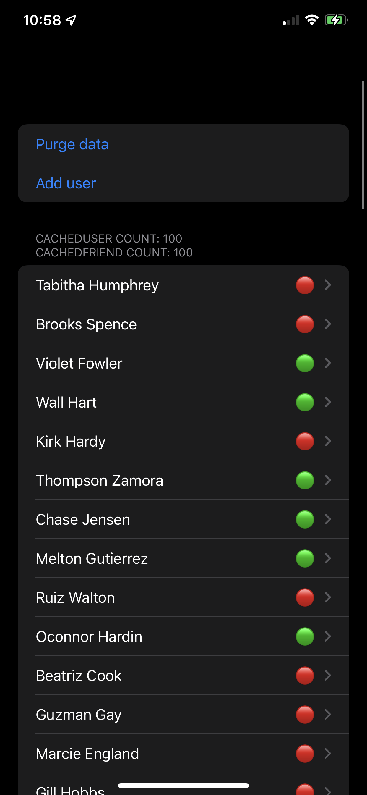
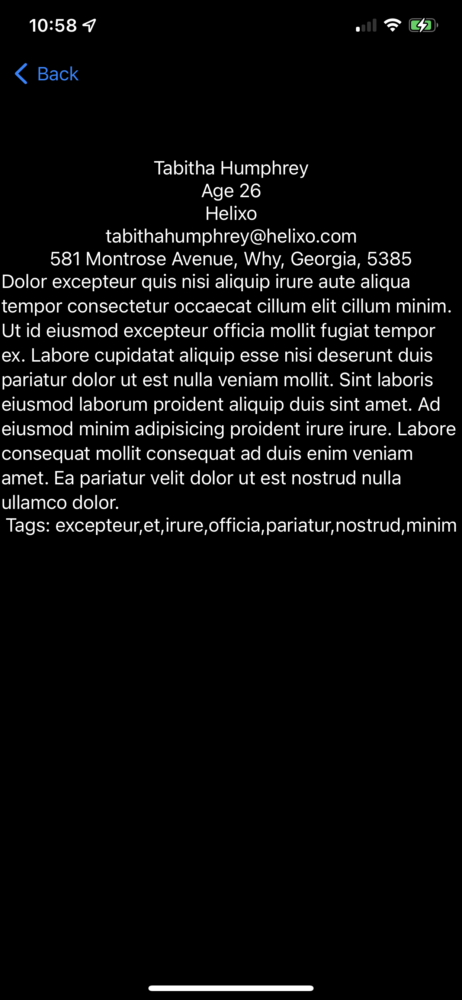

# JSONParseLearn
Learning to parse json. Day 60 challenge 100 days of swiftUI

This is a simple program to learn about the ins and outs of parsing json with xcode and swiftui. It pulls a json file from online and parses it into a core data object. There is not much point to this outside of learning and showing those systems in work.

If you are looking for help completeing this challenge, feel free to look at my code and use anything you like. Just make sure that you understand things and are not just copy pasting. Have fun!
